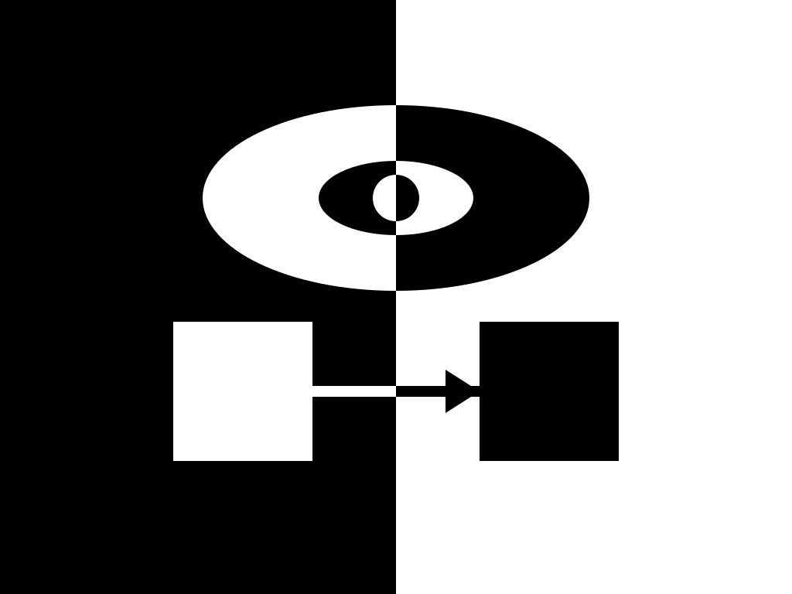
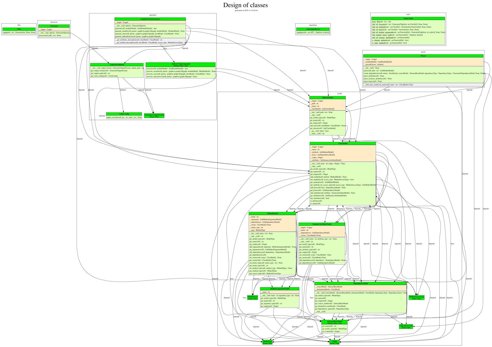

[](https://github.com/thomas-lehmann-private/codevinci/actions/workflows/build-action.yaml)
[](https://codecov.io/gh/thomas-lehmann-private/codevinci)
[](https://thomas-lehmann-private.github.io/codevinci)



## What is CodeVinci?

CodeVinci is a Python source code analysis tool designed to generate clear, expressive diagrams of your project’s internal structure. By parsing Python modules, it extracts and visualizes:

- Module relationships
- Class hierarchies
- Instance attributes
- Methods and their arguments
- Inter-module and inter-class dependencies

The goal is to provide a powerful, modern alternative to tools like pdoc and pyreverse, with rich visual output, color-coded information layers, and an emphasis on intuitive understanding of complex codebases.

In the future, CodeVinci will also support HTML documentation generation, using the same analysis engine to produce cohesive, navigable documentation for entire Python projects.

## Why the name “CodeVinci”?

The name CodeVinci is inspired by Leonardo da Vinci, who combined technical precision with artistic clarity. His detailed sketches and diagrams made complex mechanisms understandable at a glance.
Similarly, CodeVinci aims to:

- illuminate the inner workings of a codebase
- reveal structure through visually meaningful diagrams
- present technical information with clarity and elegance

The name reflects the tool’s mission: turning Python code into insightful, visually structured representations, much like da Vinci’s ability to transform ideas into iconic diagrams.

# Quick Start

**Please note**: It will be available on PyPI when all features for first release are complete.

## Example usage with nox and Github

```python
@nox.session
def codevinci_help(session):
    session.install("git+https://github.com/thomas-lehmann-private/codevinci.git@main")
    session.run("codevinci", "--help")
```

## Codevinci Design

Current design (work still in progress):



## License

CodeVinci is intended to be released under the MIT License, ensuring it remains open, flexible, and easy to integrate into both personal and professional workflows.
